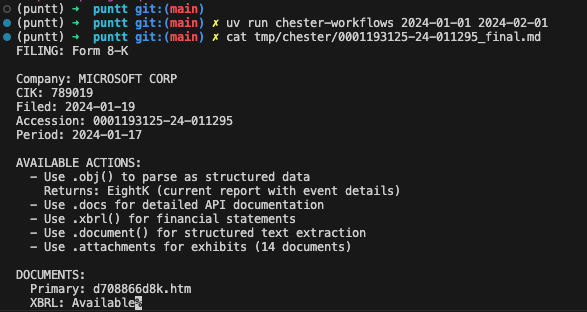
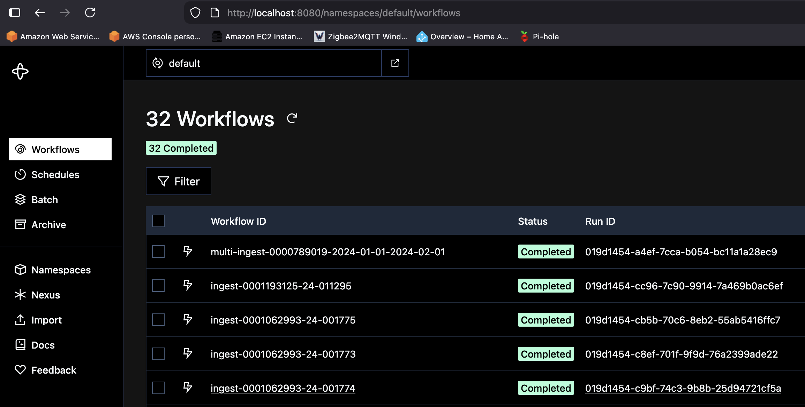

# Chester the ingester

Ingest EDGAR API data using temporal workflows.
This project offers a toy application that:

- downloads all available EDGAR API data for a set of companies and schedules an ongoing incremental download for newly filed documents: `uv run chester-workflows`
- downloads all available EDGAR API data for a set of companies in a given date range: `uv run chester-workflows YYYY-MM-DD YYYY-MM-DD`

Filing documents are downloaded to local disk using the edgartools package.
The raw edgartools.Filing object is pickled to disk along with a LLM-ready prompt MD file
with metadata about the file.
Files are placed in `tmp/chester/{accession_number}*` by default.



## Running the project

### Pre-reqs

You must have `uv` and a recent version of docker desktop available.
The project specifies Python >=3.14.

### Running locally

Fire up the infra using docker with:

```
uv run chester-compose-up
```

Launch temporal workers with:

```
uv run chester-worker
```

Download all filings available between 2026-01-01 and 2026-03-01 with

```
uv run chester-workflows 2026-01-01 2026-03-01
```

Download all available filings and schedule ongoing incremental downloads
(this will take a long time, and the scheduled workflows will never "finish"):

```
uv run chester-workflows
```

Visit http://localhost:8080 to see the temporal UI:



### Cleaning up

Run `uv run chester-compose-down` to tear down your infra.

